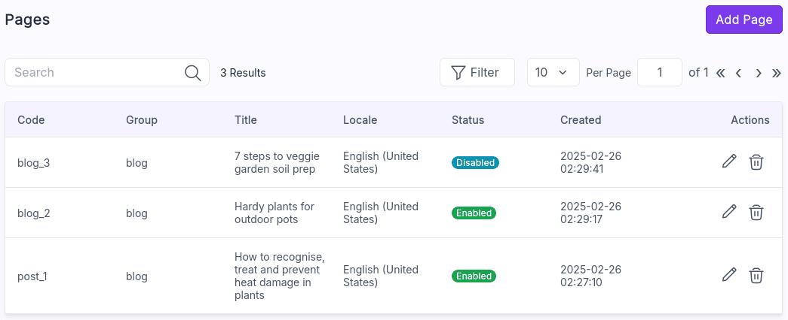

# UnoPim CMS

An UnoPim package to add a CMS Page feature.



# Installation

- Run the following command:

```bash
composer require magentix/unopim-cms
```

- Add the module to `config/concord.php`:

```php
 <?php

 return [
    'modules' => [
        /* ... */
        \Magentix\Cms\Providers\ModuleServiceProvider::class,
    ]
 ];
```

- Run the commands to execute migrations and clear the cache:

```bash
php artisan migrate
php artisan optimize:clear
```

# Enrich Page entity with new attributes

You can easily add new attributes with a custom package:

- [Example of a custom CMS page package](https://github.com/magentix/unopim-cms-custom)

# API

## GET All pages

### Endpoint

```
GET {{url}}/api/v1/rest/pages
```

### Query Params

| Param   | Value                                     |
|---------|-------------------------------------------|
| filters | {"status":[{"operator":"=","value":"1"}]} |
| page    | 1                                         |
| limit   | 10                                        |

### Code Snippet

```bash
curl --location --globoff '{{url}}/api/v1/rest/pages' \
--header 'Accept: application/json' \
--header 'Authorization: Bearer {{token}}'
```

```bash
curl --location --globoff '{{url}}/api/v1/rest/pages?filters={"status":[{"operator":"=","value":"1"}],"slug":[{"operator":"=","value":"my-slug"}]}&limit=1' \
--header 'Accept: application/json' \
--header 'Authorization: Bearer {{token}}'
```

### Response

```json
{
   "data":[
      {
         "id":20,
         "title":"How to recognise, treat and prevent heat damage in plants",
         "content":"",
         "locale":"en_US",
         "group":"blog",
         "code":"post_1",
         "slug":"how-to-recognise-treat-and-prevent-heat-damage-in-plants",
         "user_id":0,
         "status":1,
         "created_at":"2025-02-25T20:57:10.000000Z",
         "updated_at":"2025-02-25T21:03:19.000000Z"
      }
   ],
   "current_page":1,
   "last_page":4,
   "total":4,
   "links":{
      "first":"http:\/\/localhost.unopim\/api\/v1\/rest\/pages?limit=1&page=1",
      "last":"http:\/\/localhost.unopim\/api\/v1\/rest\/pages?limit=1&page=4",
      "next":"http:\/\/localhost.unopim\/api\/v1\/rest\/pages?limit=1&page=2",
      "prev":null
   }
}
```

## GET page by page code

### Endpoint

```
GET {{url}}/api/v1/rest/pages/{code}
```

### Code Snippet

```bash
curl --location --globoff '{{url}}/api/v1/rest/pages/my_code' \
--header 'Accept: application/json' \
--header 'Authorization: Bearer {{token}}'
```

### Response

```json
{
   "id":20,
   "title":"How to recognise, treat and prevent heat damage in plants",
   "content":"",
   "locale":"en_US",
   "group":"blog",
   "code":"post_1",
   "slug":"how-to-recognise-treat-and-prevent-heat-damage-in-plants",
   "user_id":0,
   "status":1,
   "created_at":"2025-02-25T20:57:10.000000Z",
   "updated_at":"2025-02-25T21:03:19.000000Z"
}
```

## POST Create a page

### Endpoint

```
POST {{url}}/api/v1/rest/pages
```

### Body

```json
{
   "code":"post_1",
   "title":"Hardy plants for outdoor pots",
   "content":"<p>Any experienced gardener will tell you that it's all about the soil.<\/p>",
   "locale":"en_US",
   "group":"blog",
   "slug":"hardy-plants-for-outdoor-pots",
   "status":1
}
```

### Code Snippet

```bash
curl --location --globoff '{{url}}/api/v1/rest/pages' \
--header 'Content-Type: application/json' \
--header 'Accept: application/json' \
--header 'Authorization: Bearer {{token}}' \
--data '{
   "code":"post_1",
   "title":"Hardy plants for outdoor pots",
   "content":"<p>Any experienced gardener will tell you that it''s all about the soil.<\/p>",
   "locale":"en_US",
   "group":"blog",
   "slug":"hardy-plants-for-outdoor-pots",
   "status":1
}'
```

### Response

```json
{"success":true,"message":"Page created successfully"}
```

```json
{"success":false,"message":"Validation failed.","errors":["The title field is required."]}
```

```json
{"success":false,"message":"Validation failed.","errors":["The code has already been taken. (and 1 more error)"]}
```

## PUT Update a page

### Endpoint

```
PUT {{url}}/api/v1/rest/pages/{code}
```

### Body

```json
{
   "title":"Hardy plants for outdoor pots",
   "content":"<p>Any experienced gardener will tell you that it's all about the soil.<\/p>",
   "locale":"en_US",
   "group":"blog",
   "slug":"hardy-plants-for-outdoor-pots",
   "status":1
}
```

### Code Snippet

```bash
curl --location --globoff --request PUT '{{url}}/api/v1/rest/pages/my_code' \
--header 'Content-Type: application/json' \
--header 'Accept: application/json' \
--header 'Authorization: Bearer {{token}}' \
--data '{
   "title":"Hardy plants for outdoor pots",
   "content":"<p>Any experienced gardener will tell you that it''s all about the soil.<\/p>",
   "locale":"en_US",
   "group":"blog",
   "slug":"hardy-plants-for-outdoor-pots",
   "status":1
}'
```

### Response

```json
{"success":true,"message":"Page updated successfully"}
```

```json
{"success":false,"message":"Page with code \"my_code\" was not found"}
```

```json
{"success":false,"message":"Validation failed.","errors":["The title field is required."]}
```
